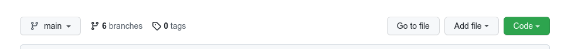
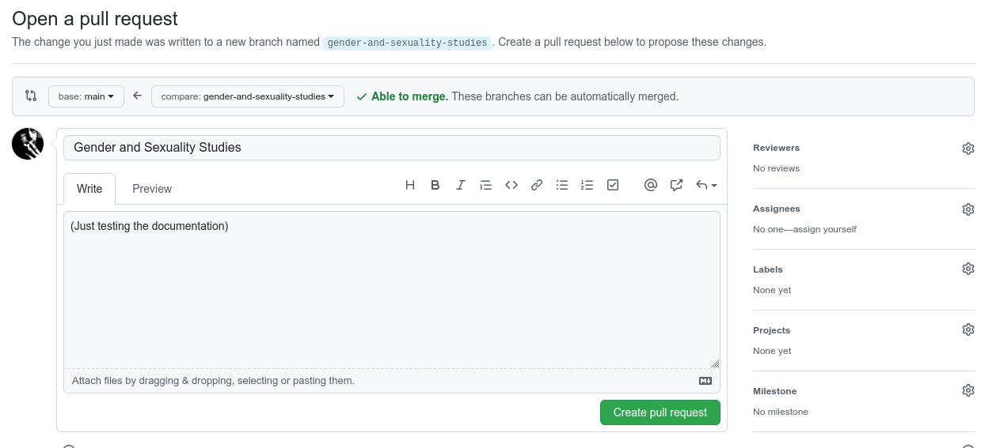
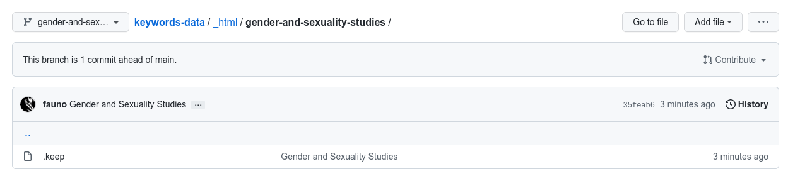
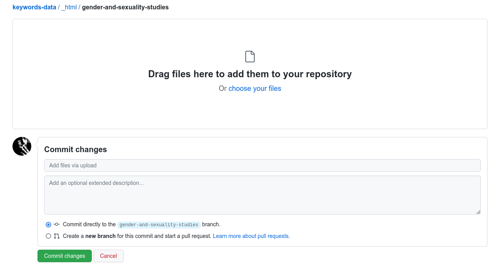
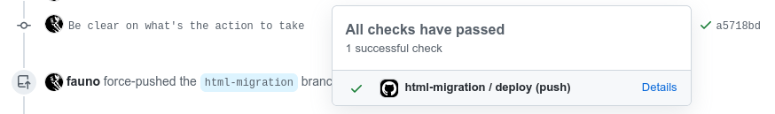
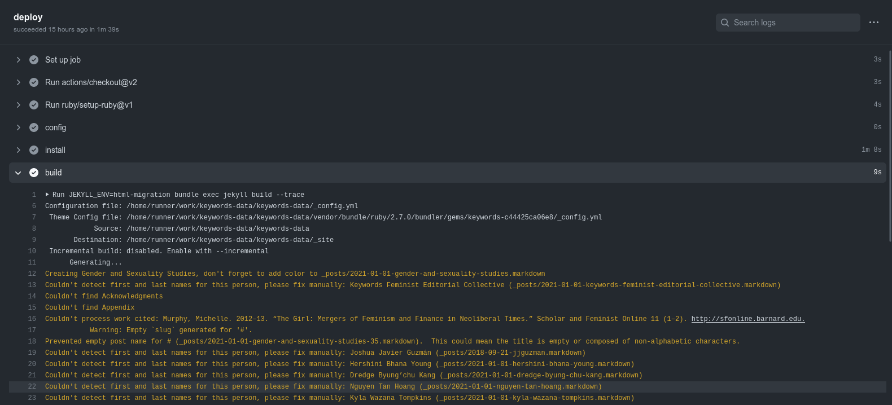

# Adding a new book

The migration process involves a plugin located at
`_plugins/html_migration.rb` that takes a book in HTML format and
automates most of the publication process.

## Before start

You will need:

* HTML file for the book
* About text in Markdown format
* Book color
* Book cover image
* List of essays published online
* To "slugify" the book title: convert it to downcase, remove
  non-alphabetic characters and replace spaces with dashes.

  For instance, "Gender and Sexuality Studies" has
  a "gender-and-sexuality-studies" slug.

  The slug is important because it creates the URL for the book and
  everything inside it.

## Adding the book from Github

* Navigate to <https://github.com/nyu-dss/keywords-data>.  You'll need
  an account with access to this repository.

* Make sure you are on the `main` branch.

  

* Go to "Add file" and choose the "Create new file" option.

* Create an about page inside the migration directory.

  On the "Name your file" field, enter `_html/`, when you press the `/`
  it will create a new field, enter the slug here and add a new `/`.

  Now add `about.md` as file name and paste the contents on the text
  box.  **The first paragraph is going to be the excerpt on the book
  page**.

  If you don't have an about page yet, create an empty `.keep` file
  which is a convention for making Git/Github keep empty directories.

  

* Scroll to bottom to the "Commit new file" box.  Add a title and
  optional description and select the "Create a new branch" option.

  When it asks for the branch name you can leave the suggestion or use
  the slug for consistency.

* You will be sent to an "Open a pull request" page.  You can leave this
  page open an open <https://github.com/nyu-dss/keywords-data> in a new
  tab.

  

* In this new tab, select the newly created branch to switch into it.

  

* On the file list, open `_html/` and then the newly created directory.
  You'll see the `.keep` file.

* Now go to "Add file" and choose "Upload files" and upload the HTML
  file.  On the "Commit changes" box add a title and optional description,
  and leave the "Commit directly to XXX branch" option checked.

  

* Go back to the "Open a pull request" tab or use the suggested "Compare
  & pull request" button to open a PR.

* Opening the PR will start the migration process.

## Adding the book from git command line

* Create a new branch from `main` using the book slug and switch to it:

  ```bash
  git checkout main
  git checkout -b gender-and-sexuality-studies
  ```

  Note: The branch name doesn't matter, it's just for consistency.

* Create a folder with the slug inside the `_html/` folder.

  For instance, "Gender and Sexuality Studies" has
  a "gender-and-sexuality-studies" slug.

  You'll have a `_html/gender-and-sexuality-studies/` folder.

* Place the HTML file inside this folder and rename it to `index.html`.

  You'll have a `_html/gender-and-sexuality-studies/index.html` file.

* Commit the changes and push to the repository.

  ```bash
  git add _html/gender-and-sexuality-studies/index.html
  git commit -m "Gender and Sexuality Studies"
  git push -u origin gender-and-sexuality-studies
  ```

* Go to the Github web interface and create a Pull Request.


## After the book is added

When you open the Pull Request (PR for short), a Github Action drops in
and runs the migration process.  If everything goes OK, in a few minutes
you'll find a new commit on the same PR with all the pages created.


The OK is a green checkmark on the right of the commit message.  If it
failed, you'll see a red X mark.  Pressing it opens the details.  Show
should check the details, the migration process can't do everything
automatically and will require manual intervention in a few cases.  It
will tell you what action you should take.



Read below for messages and what they mean.



Once changes are done, you can remove the book directory under the
`_html/` directory, before merging the PR into the `main` branch. This
will run the build and publication process, at the end of which the site
will be live at <https://keywords.nyupress.org/>

### Removing the book files before merging

* Switch the current branch to the branch for the book.  This can be
  done from the branch switch when you made sure you were on the `main`
  branch.  It's the same process for switching branches.

* Open the `_html` directory on the file list and then the book
  directory.

* Open each file (`index.html`, `about.md`) and use the trash can icon
  to remove it from the branch.

From `git`, the removal can be done using:

```bash
git checkout book-branch
git rm -r _html/book-directory/
git commit -m "remove book"
git push
```

### Regular messages

* Creating Gender and Sexuality Studies, don't forget to add color to _posts/2021-01-01-gender-and-sexuality-studies.markdown 

  This message reminds you to add the color attribute on the book file.

* Couldn't find Acknowledgments

  This message is looking for certain pages to exist on the HTML file.
  If the book doesn't have this section you can ignore this message.  If
  the book does have it, it probably means the internal structure for
  the HTML changed and the plugin needs to be updated.

* Prevented empty post name for # (_posts/2021-01-01-gender-and-sexuality-studies-35.markdown).  This could mean the title is empty or composed of non-alphabetic characters. 

  Sometimes an essay title can't be slugified because it only contains
  non-alphabetic characters.  In these cases, to be able to create the
  file with a consistent name, the migration process creates an ad hoc
  slug composed of the book's slug and the ASCII codes for the
  characters (35 is the ASCII code for #).

  The slug on the file name isn't really important, but you should edit
  the permalink field so it has an URL.  If you don't do this, the URL
  will be the same as the ad hoc slug.

* Couldn't detect first and last names for this person, please fix manually: (_posts/2021-01-01-hershini-bhana-young.markdown) 

  This means the person has more than two names and the migration plugin
  can't guess which of the middle words are first or last names (and it
  shouldn't).

  This affects the sorting order on the Contributors page.  To fix this,
  edit the list files manually and add a `first_name` and `last_name`
  (specially the latter) field on each one.

* Creating person profile who isn't linked to any page or essay: Anisha Ahuja

  The person is listed on the Contributors page but didn't author an
  essay or isn't an editor.  The migration process creates a profile and
  links it to the book, so you shouldn't have to do anything.  But if
  the person is an author/editor, this may mean the HTML file is missing
  authorship information.

### Rare messages

* Found similar name for ...

  Sometimes authors/editors and contributors are spelled different (a
  middle name or initials added, etc.) so the migration looks for
  similar names.  If it didn't find a correct match, you need to fix
  this manually, by creating a person profile before redoing the
  migration.

* Couldn't find SECTION

  This means the HTML structure changed and the migration plugin needs
  to be updated.

* Couldn't process work cited ...

  The work cited format couldn't be detected and the migration plugin
  couldn't find an authorship part.
